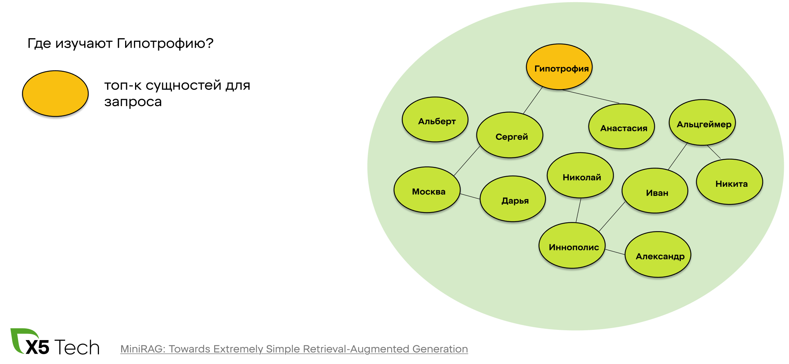
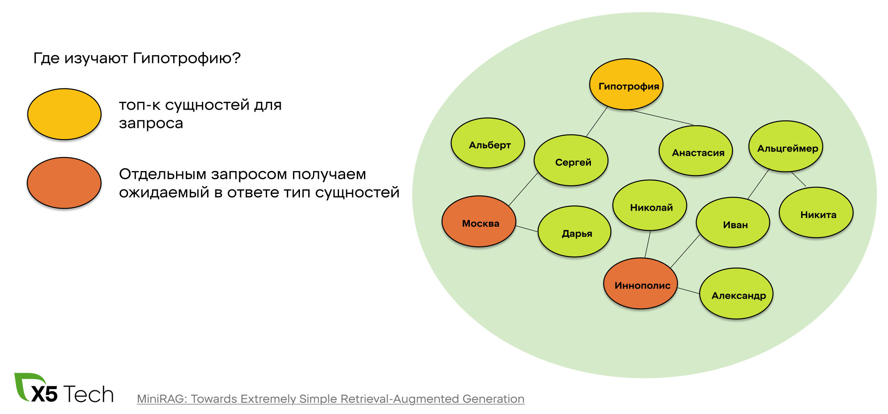
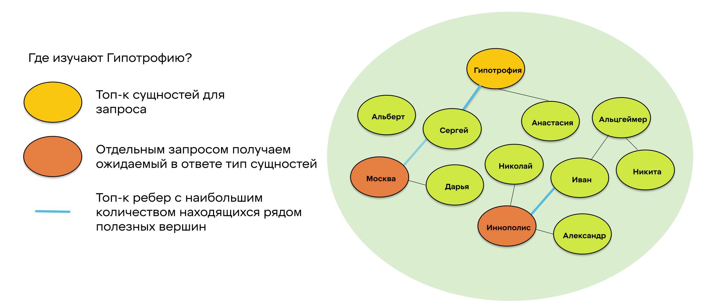
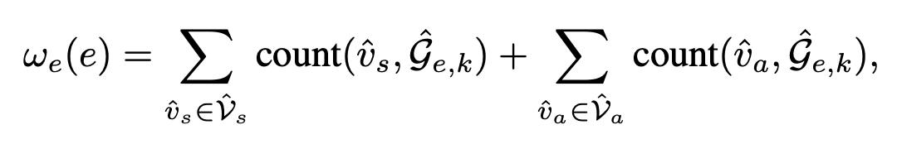
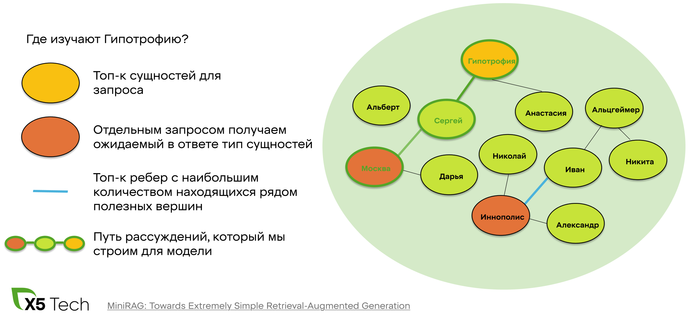
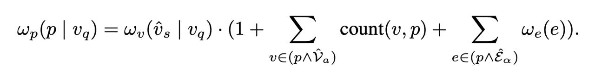
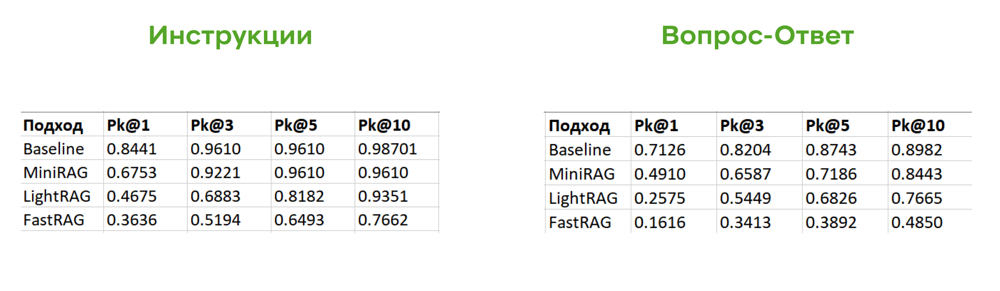

# Название

## Введение
- О чём статья и зачем
- Что такое РАГ и какие проблемы мы хотим решить
- Что такое граф знаний
- Как они объединяются
- Референсы с конференций и новые статьи (это новый хайповый подход с более интуитивной идеей понимания наших данных)

Впервые идея использования графов знаний для RAG`ов была представлена в рамках Microsoft GraphRAG, опубликованного в начале 2024го. На данный момент это направление активно развивается благодаря новым подходам предлагающим еще более интуитивное понимание контекста и State-of-the-art показатели на вопросно-ответных бенчмарках. 

## Теория
- Виды графовых РАГов
- GraphRAG Microsoft (откуда всё началось)
- Как добавлять новые документы вместо переиндексации = индексация наших алгоритмов

### Более продвинутые алгоритмы, которые мы пробовали

#### FastRAG

#### LightRAG

#### MiniRAG  
Модификация подхода LigthRAG, которая значительно меньше использует LLM на этапе ретрива, а делигирует составление контекста к запросу исключительно графовым алгоритмам. Подход c помощью кастомизированной эвристики находит в графе путь рассуждений, который наиболее логично соединяет вершины и ребра связанные с контекстом запроса.

##### Индексация

Процесс почти полностью повторяет индексацию LigthRAG

- С помощью 1-shot промпта превращем чанк в 2 таблицы
  - Информация о сущностях(Название, тип)
  - Информация о связях(смежные вершины, короткое описание, численная сила связи)  
``` json
("entity"{tuple_delimiter}СИСТЕМА ОПЛАТЫ ТРУДА{tuple_delimiter}объект{tuple_delimiter}Система оплаты труда для сотрудников администрации магазинов){record_delimiter})
("relationship"{tuple_delimiter}СИСТЕМА ОПЛАТЫ ТРУДА{tuple_delimiter}ДИРЕКТОР МАГАЗИНА{tuple_delimiter}Система оплаты труда определяет условия оплаты для директора магазина{tuple_delimiter}оплата труда{tuple_delimiter}5){record_delimiter}
```
- Дедуплицируем с уже находящимися в графе элементами и добавляем новые
- В отличнии от LigthRAG не извлекаем high и low-level keywords

##### Ретрив

Можно выделить 5 основных этапа

1. Нахождений сущностей, которые вероятно релевантны к ответу
2. Нахождение релевантных к запросу сущностей
3. Выделение релевантных ребер графа
4. Построение путей рассуждений
5. Обьединение лучших путей

- **Релевантные к запросу сущности**  
  Для построения путей рассуждения нам понадобятся вершины из которых мы можем начать.  
  С помощью 0-shot промпта выделяем сущности в запросе пользователя и для каждой найденной сущности находим близжайшую вершину в графе используя эмбеддинг.  
  

- **Релевантные к ответу сущности**  
  Текст ответа будет отличаться от запроса не только структурно, но иногда и по смыслу.  
  ПРИМЕР  
  Поэтому проводя поиск только на основе векторизированного запроса мы рискуем потерять упустить некоторые релевантные сущности.  
  Для выделения сущностей близких к ответу мы просим модель определить релевантные типы сущностей и выделяем из общего графа подмножество подходящих вершин.  
   
  Эти вершины будут конечными вершинами путей рассуждений.

- **Выделение релеантных ребер графа**  
  Мы уже нашли подмножества начальных и конечных вершин для наших путей осталось найти промежуточные ребра для упрощения перебора возможных путей.  
  
  Отбор осуществляем среди смежных к найденным вершинам ребер. Сортируем их используя слудующую формулу важности ребра
  
    ДОПИСАТЬ НОТАЦИИ

- **Построение пути расслеждений**  
  Теперь мы готовы провести логический путь от запроса к ответу по нашему графу. Перебираем пути длины n соединяющие вершины запроса с вершинами для ответа и сортируем их по количеству попавших в путь релевантных ребер и вершин.
  
  Ранжируем пути на основе следующей формулы
  
  Получив топ k лучших путей мы формируем контекст их их сущностей и привязанных к ним чанков.

## Результаты

- **Дизайн экспериментов**  
  Нашей основной задачей изначально было тестирование данных алгоритмов в домене X5  
  Мы проводили эксперименты на двух базах знаний чтобы узнать применимость алгоритмов к разным видам данным
  - ~500 рабочих инструкций  
    Бэйзлайн ретрива: RAG  
    Бейзлайн генераций: RAG + Reranker + Chaining
  - ~1500 записей форамата вопрос-ответ  
    Бэйзлайн ретрива: RAG + симметричный поиск
        
    
- Метрики

## Заключение
- Обоснованность использования в нашем домене
- Варианты улучшений