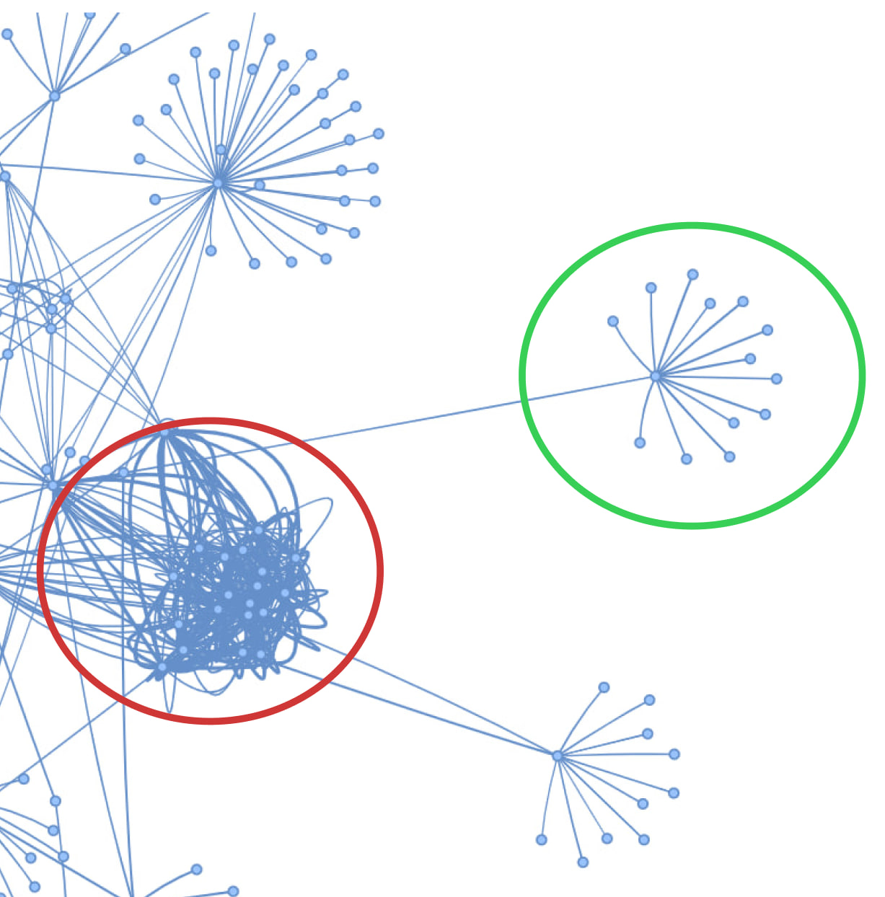

# Сравнение графовых RAG в чат-ботах

## Введение

### О чём статья и зачем

Всем привет! Мы — группа начинающих ML-специалистов в X5 Tech в команде чат-ботов. В этой статье мы расскажем о state-of-the-art подходах использующих графы знаний в RAG (Retrieval-Augmented Generation) и сравним три алгоритма: **FastRAG**, **LightRAG** и **MiniRAG**. Также исследуем, как эти методы показывают себя в сравнении с классическим RAG в обработке баз знаний и поиска релевантной информации.

### Что такое RAG

**RAG** — это гибридная архитектура, сочетающая поиск информации и генерацию текста через LLM. Классический RAG использует лексический или семантический поиск по текстовым фрагментам в базе знаний. Затем найденная информация и запрос подаются в LLM, чтобы она, используя необходимую информацию, ответила на запрос. Подробнее можно почитать [здесь](https://habr.com/ru/articles/779526/).  

  

### Зачем нужен графовый RAG

К сожалению, обычный RAG не лишён недостатков:  
1. Ограниченная семантическая интеграция: извлечение информации происходит без учета междокументных и внутридокументных связей. 
2. LLM не понимает полного контекста, так как берётся только часть исходных данных.  
3. При увеличении количества данных ухудшается качество поиска.
4. Отсутствие структурированных связей: Стандартный RAG не моделирует отношения между сущностями в данных.

RAG, основанный на графе знаний, способен полностью или частично решить данные недостатки.

### Что такое граф знаний

**Граф знаний** — это структура данных, где:  
- **Узлы** — сущности (например, `ПОКУПАТЕЛЬ`, `ДИРЕКТОР`) или целый документ.  
- **Рёбра** — связи между ними (например, *«регулируется»*, *«влияет на»*).  

В отличие от обычного векторного поиска, графы сохраняют семантические отношения. Это позволяет связывать информацию из различных документов и отвечать на более сложные вопросы.  

  

### Использование графа знаний

Графовые RAG имеют схожую структуру с обычным алгоритмом, но вносят изменения в некоторые шаги:  
 1. **Индексация**: из документов извлекаются сущности и связи (через LLM), формируя граф.  
 2. **Поиск**: вместо векторного сравнения фрагментов система обходит граф, находя связанные сущности и контексты.  
 3. **Генерация**: LLM получает не только текстовые фрагменты, но и пути из графа, что улучшает связность ответов.  

# Общий обзор LightRAG

LightRAG – это тоже open source библиотека RAG, основанного на графовых структурах. Главной отличительной чертой LightRAG является двухуровневая поисковая система. Она позволяет найти как общую, так и более низкоуровневую информацию. Также преимуществом данного алгоритма является эффективность и гибкость, потому что поиск происходит достаточно быстро, не затрачивая много ресурсов, и LightRAG, как и FastRAG, легко адаптируется к новым данным, без необходимости переиндексации.

## Индексация данных в LightRAG

Индексация в LightRAG состоит из следующих этапов:

1.  **Сегментация текста.** Документы разбиваются на небольшие фрагменты для упрощения анализа.
2.  **Извлечение сущностей и отношений.** Так как LightRAG – это сущностный графовый RAG, то на данном этапе происходит извлечение сущностей из фрагментов документов, например `Иван`, `Альцгеймер`, и их взаимосвязи. Сущности содержат в себе следующую информацию - Имя, тип и описание, а отнощения - исходную и конечную вершину, описание отношения и силу отношения (от 1 до 10)
4.  **Генерация ключ-значение.** Для сущностей и отношений генерируются ключи – это слово или короткая фраза. Как правило ключ для сущностей – сами сущности, а отношения могут иметь несколько различных ключей. Данный механизм позволяет сделать поиск быстрее и точнее.
5.  **Дудебликация.** На данном этапе идентичные объекты объединяются, что позволяет уменьшить затраты на операции, связанные с графом знаний за счёт уменьшения его размера.
6.  **Построение графа знаний.** Сущности становятся узлами, а связи — рёбрами графа, отражающими зависимости.

Есть возможномть посмотреть на созданный граф знаний. Это помогает лучше понять структуру базы знаний.

  

## Поиск информации (Ретрив) в LightRAG

Существует 2 уровня поиска:

1.  **Низкоуровневый поиск.** Он фокусируется на конкретных сущностях. Например: “Где живёт Иван, который изучает Альцгеймера”. Этот уровень сконцентрирован на получении сущностей, их характеристиками и отношениями.
2.  **Высокоуровневый поиск,** охватывающий общие темы и концепции. Он концентрируется на отношениях между сущностями, например, что такое Альцгеймер? Запросы на этом уровне объединяют информацию по нескольким связанным объектам и взаимосвязям.

Ретрив включает себя использование графа знаний и векторного представления его элементов. Поиск разбит на несколько этапов:

1.  **Извлечение ключевых слов.** Вначале, с помощью LLM, из запроса извлекаются ключевые слова (отдельно для низкоуровневого и высокоуровневого запроса).
2.  **Сопоставление ключевых слов.** Ключевые слова низкоуровневого запроса сопоставляются с сущностями, затем ключевые слова высокоуровневого – с отношениями.
3.  **Поиск дополнительной информации.** Чтобы улучшить связанность ответа, LightRAG использует всех соседних (смежных) вершин графа, найденного на предыдущем этапе.
4.  **Передача информации в LLM**. На последнем этапе отношения, вершины и полученные фрагменты документов передаются LLM для получения финального ответа.

Двухуровневая поисковая система облегчает эффективный поиск связанных сущностей и связей за счет подбора ключевых слов и повышает полноту результатов за счет использования графа знаний.

## Результаты LightRAG на практике:

Индексация и ретрив в данном алгоритме работают правда достаточно быстро. Но по точности данный алгоритм, так и не смог обойти классический RAG на наших датасетах. На это повлияли следующие причины:

1.  **Сильная зависимость от гиперпараметров** (`top_k`, длины контекстных окон, промпт, `similarity_threshold`). Пришлось перебрать достаточно большое количество вариантов, чтобы улучшить результат.
2.  **При малом количестве релевантных фрагментов** документов без уникальных сущностей, релевантная информация теряется среди похожих на неё.
3.  **Ранкинг отношений происходит на основе LLM**, и она часто выставляет неправильный ранг. По этой причине вершина с множеством соседей может иметь более высокий ранг при ретриве, чем уникальная только для данного чанка вершина. Например вопрос: `Как взять отгул?`. Генерируются следующие ключевые слова – `'ОТГУЛ'`, `'ОТПУСК'`. Слово `ОТГУЛ` встречается в нашем датасете гораздо реже, чем `ОТПУСК`, но LLM присвоила ранг отношениям содержащим слово `ОТПУСКУ` больше, чем `ОТГУЛУ`, поэтому нам вначале выдадутся документы и отношения про отпуск, а затем про отгул.
4.  **Берутся все соседи подобранной вершины,** а соседей может быть большое количество, в следствии чего релевантный документ теряется, среди множества похожих на него. Данную проблему можно заметить на визуализированном графе знаний.
  

