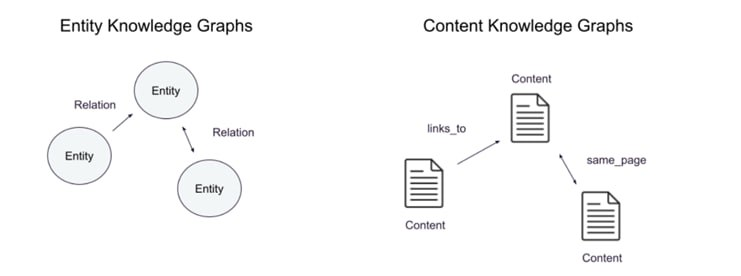
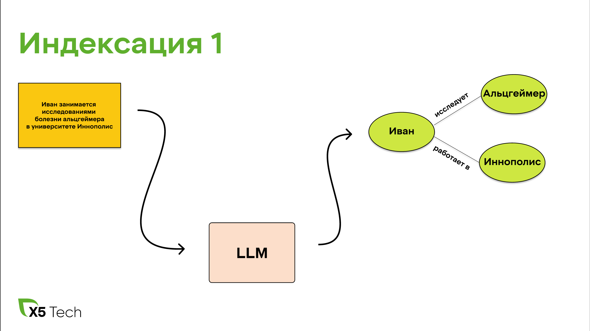
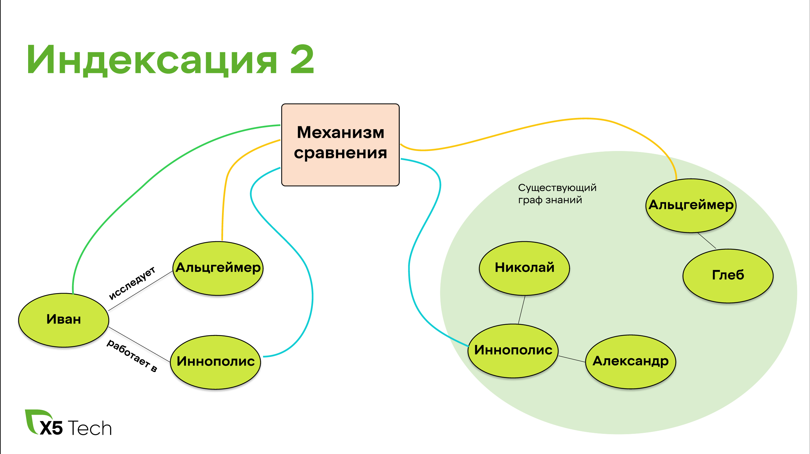
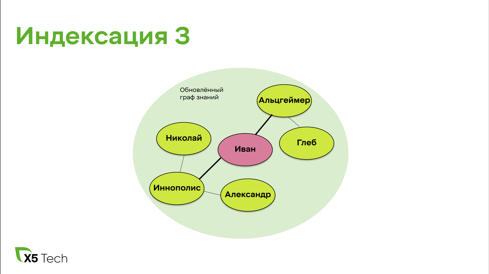
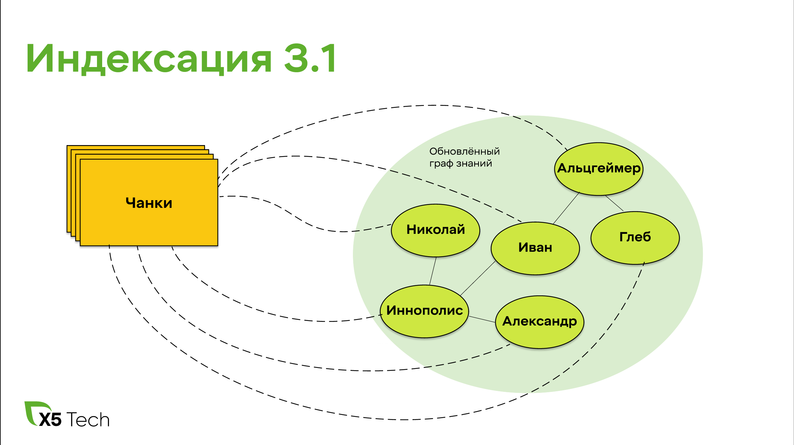
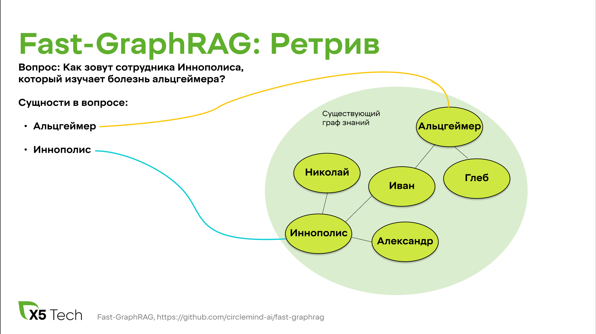
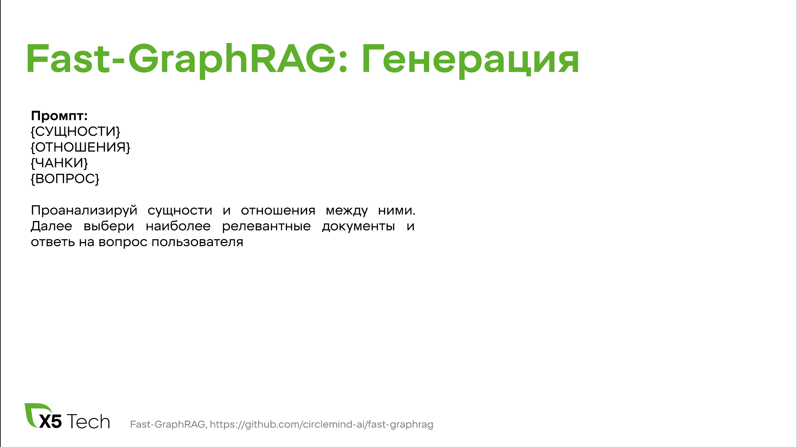

# Сравнение графовых RAG в чат-ботах

## Введение

### О чём статья и зачем

Всем привет! Мы — группа начинающих ML-специалистов в X5 Tech в команде чат-ботов. В этой статье мы расскажем о state-of-the-art подходах использующих графы знаний в RAG (Retrieval-Augmented Generation) и сравним три алгоритма: **FastRAG**, **LightRAG** и **MiniRAG**. Также исследуем, как эти методы показывают себя в сравнении с классическим RAG в обработке баз знаний и поиска релевантной информации.

### Что такое RAG

**RAG** — это гибридная архитектура, сочетающая поиск информации и генерацию текста через LLM. Классический RAG использует лексический или семантический поиск по текстовым фрагментам в базе знаний. Затем найденная информация и запрос подаются в LLM, чтобы она, используя необходимую информацию, ответила на запрос. Подробнее можно почитать [здесь](https://habr.com/ru/articles/779526/).  

  

### Зачем нужен графовый RAG

К сожалению, обычный RAG не лишён недостатков:  
1. Ограниченная семантическая интеграция: Извлечение информации происходит без учета междокументных и внутридокументных связей. 
2. LLM не понимает полного контекста, так как берётся только часть исходных данных.  
3. При увеличении количества данных ухудшается качество поиска.
4. Отсутствие структурированных связей: Стандартный RAG не моделирует отношения между сущностями в данных.

RAG, основанный на графе знаний, способен полностью или частично решить данные недостатки.

TODO: убрать дублирование с теорией
### Что такое граф знаний

**Граф знаний** — это структура данных, где:  
- **Узлы** — сущности (например, `ПОКУПАТЕЛЬ`, `ДИРЕКТОР`) или целый документ.  
- **Рёбра** — связи между ними (например, *«регулируется»*, *«влияет на»*).  

В отличие от обычного векторного поиска, графы сохраняют семантические отношения. Это позволяет связывать информацию из различных документов и отвечать на более сложные вопросы.  

  

### Использование графа знаний

Графовые RAG имеют схожую структуру с обычным алгоритмом, но вносят изменения в некоторые шаги:  

## Теория

### Виды графов знаний

**Графы знаний** бывают двух видов: **сущностные** и **контекстные**.

#### Сущностный граф знаний
Сущностный граф знаний представляет информацию в виде узлов и связей, где:
- **Узлы** обозначают конкретные сущности (люди, места, объекты и т.д.),
- **Связи** отражают отношения между сущностями.

Например:
- Узел, представляющий человека, может быть связан с узлом, представляющим город, посредством связи «живет в», указывающей на место проживания.
- Два узла, представляющие компании, могут быть связаны через связь «конкурент», показывая их конкурентные отношения.
- Узел, представляющий произведение искусства, может быть связан с узлом, представляющим художника, посредством связи «создано», указывающей на автора.

В сущностных графах знаний акцент делается на конкретных сущностях и их взаимосвязях, что позволяет эффективно моделировать и анализировать сложные сети отношений в различных областях знаний.

#### Контекстный граф знаний
Контекстный граф знаний — это структура данных, где:
- **Узлы** содержат исходные данные (текстовые отрывки, изображения, таблицы и т.д.).
- **Связи** отражают структурные или семантические отношения между этими данными.

Ребра между узлами могут представлять различные типы связей:
- Фрагмент текста с гиперссылкой может быть связан с соответствующим контентом.
- Два фрагмента с общими ключевыми словами могут иметь связь, указывающую на их схожесть.
- Отрывки в документе могут ссылаться на определения ключевых терминов.

В отличие от сущностных графов, где информация сокращается до простых аннотаций, контекстные графы сохраняют полноту исходных данных. Данные такого вида более эффективны в качестве контекста для LLM. 

### Microsoft GraphRAG: откуда всё начиналось

**Microsoft GraphRAG** — это метод, представленный Microsoft Research в 2024 году, который сочетает RAG с графовыми структурами для улучшения обработки сложных текстовых данных. Он создан для эффективного поиска, анализа и генерации информации в неструктурированных источниках, таких как корпоративные документы и научные статьи.

#### Отличительные особенности:
- Гибридный подход, совмещающий элементы контекстного и сущностного графа знаний.
- Группировка узлов в сообщества с построением иерархии, что позволяет моделям LLM лучше понимать контекст.
- Использование LLM для построения графа без явной разметки данных.

#### Основные шаги
1) Индексация
    - **Разделение текста:** Входной корпус текста разделяется на чанки, которые выступают в роли анализируемых единиц, обеспечивая детализированные ссылки в результатах.
    - **Извлечение данных:** С помощью LLM извлекаются сущности, отношения и ключевые утверждения.
    - **Иерархическая кластеризация:** Граф кластеризуется с использованием метода Лейдена. Для визуализации процесса каждый круг представляет сущность (например, человека, место или организацию), его размер отражает степень значимости, а цвет – принадлежность к сообществу.
    - **Генерация суммаризации:** Суммаризация создаётся для каждого сообщества и его элементов, что помогает в понимании набора данных «снизу вверх».

2) Генерация
    - **Глобальный поиск:** Использует суммаризации сообществ для рассуждения о целостных вопросах, касающихся корпуса текста.
    - **Локальный поиск:** Расширяет запрос до соседей и связанных концепций для конкретных сущностей.
    - **DRIFT-поиск:** Похож на локальный поиск с добавлением контекста информации о сообществах.

### Механизм постепенного обновления графа

Реализация Microsoft GraphRAG имеет существенный недостаток: при добавлении новых документов требуется полная переиндексация для обновления графа знаний, что затрудняет поддержание актуальности данных. Современные алгоритмы предлагают решение в виде инкрементального обновления, позволяющего наращивать и корректировать граф без необходимости его полной перестройки.

При итеративной обработке документов реализуется следующий качественный и структурированный подход для обновления графа знаний:

1. **Извлечение сущностей и связей.** На этом этапе с помощью few-shot промпа LLM извлекаются ключевые сущности из документа, а также устанавливаются связи между ними.

2. **Идентификация синонимичных сущностей.** Далее проводится анализ на предмет синонимии и похожести сущностей, что помогает объединить повторяющуюся информацию и оптимизировать структуру графа. Для выявления синонимов зачастую используется посимвольное сравнение или косинусное сходство между эмбеддингами сущностей.

3. **Инкрементальное обновление графа.** Существующий граф знаний обновляется за счёт интеграции новой информации, извлечённой из документов, без необходимости полной перестройки. Это обеспечивает оперативное пополнение графа и его актуальность.

    - **Связывание с исходным документом.** Каждая обновлённая сущность дополнительно связывается с документом, из которого была получена информация.

## Алгоритмы, которые мы пробовали
В ходе исследования мы отобрали три state-of-the-art алгоритма, предоставляющих различные подходы к работе с графами знаний: **Fast GraphRAG**, **LightRAG** и **MiniRAG**. Эксперименты с этими моделями заключались в оценке их производительности и точности в контексте наших данных и с использованием наших продовых LLM моделей. 

### Fast GraphRAG

**Fast GraphRAG** — это открытая библиотека, предназначенная для улучшения процессов извлечения и генерации информации с помощью графов знаний.

#### Особенности Fast GraphRAG:
- **Динамическое обновление данных:** Автоматическая генерация и уточнение графов в соответствии с изменениями данных и требованиями предметной области.
- **Инкрементальные обновления:** Поддержка поэтапного добавления данных, обеспечивающая гибкость и адаптивность системы.
- **Интеллектуальное исследование:** Использование модифицированного алгоритма Page Rank для оценки важности вершин в графе с учётом предпочтений пользователя.

#### Индексация

Механизм индексации в Fast GraphRAG основан на инкрементальном подходе, который позволяет обновлять граф знаний без необходимости полной переиндексации. Семантический поиск идентифицирует синонимичные сущности в новом субграфе и в уже существующем графе. После этого происходит обновление структуры графа, что позволяет поддерживать его актуальность и целостность. 

#### Ретрив
1. **Выделение сущностей из запроса:** Few-shot промпт передаётся в LLM вместе с запросом пользователя для извлечения сущностей. Далее найденные сущности преобразуется в векторное представление с использованием эмбеддера. С помощью косинусного сходства производится поиск n ближайших узлов, которые считаются стартовыми. 

2. **Поиск релевантных узлов:** Алгоритм Personalized Page Rank вычисляет значимость узлов графа, начиная с узлов, наиболее близких к запросу.

**Инициализация:**  
Задаётся вектор предпочтений **v**, где каждому узлу, связанному с запросом пользователя присваивается значение 1, всем остальным - 0. Далее все вероятности нормализуются так, чтобы их сумма равнялась 1.

**Итеративное обновление:**  
На каждом шаге вычисляется новый вектор вероятностей **r** с учётом двух факторов:
- Вероятности перехода между узлами графа (на основе матрицы смежности графа).
- Возврата к узлам, заданным вектором предпочтений **v**.

**Формула PPR:** 
Алгоритм обновляет вектор вероятностей **r** на каждой итерации по следующей формуле:  
`r = α * (A * r) + (1 - α) * v`  
Где:
- **r** — вектор вероятностей для всех узлов графа.
- **A** — нормализованная матрица смежности графа (каждая строка нормализована так, чтобы сумма элементов равнялась 1).
- **v** — вектор предпочтений, задающий начальное распределение вероятностей.
- **α** — коэффициент затухания (обычно выбирается в диапазоне [0.85, 0.95]), который определяет вероятность перехода по рёбрам графа или возврата к узлам из вектора предпочтений.

Алгоритм повторяет итерации до тех пор, пока изменения в векторе **r** между шагами не станут меньше заданного порога. Итоговый вектор **r** содержит вероятности, которые отражают важность каждого узла графа с учётом персонализации.

3. **Формирование ответа:** На основе извлечённых данных формируется итоговый ответ, который передаётся пользователю. 

#### Заключение
TODO: дописать

Недостатки:

- Подверженность шуму исходных данных
- Значительная часть логики алгоритма возлагается на LLM
- Ограниченность информации в запросе может снизить точность оценки важности, так как PPR полагается на структуру графа, а не на семантическое понимание
- Требует тщательной настройки под каждый домен знаний

### Общий обзор LightRAG

LightRAG – это тоже open source библиотека RAG, основанного на графовых структурах. Главной отличительной чертой LightRAG является двухуровневая поисковая система. Она позволяет найти как общую, так и более низкоуровневую информацию. Также преимуществом данного алгоритма является эффективность и гибкость, потому что поиск происходит достаточно быстро, не затрачивая много ресурсов, и LightRAG, как и FastRAG, легко адаптируется к новым данным, без необходимости переиндексации.

#### Индексация данных в LightRAG

Индексация в LightRAG состоит из следующих этапов:

1.  **Сегментация текста.** Документы разбиваются на небольшие фрагменты для упрощения анализа.
2.  **Извлечение сущностей и отношений.** Так как LightRAG – это сущностный графовый RAG, то на данном этапе происходит извлечение сущностей из фрагментов документов, например `Иван`, `Альцгеймер`, и их взаимосвязи.
3.  **Генерация ключ-значение.** Для сущностей и отношений генерируются ключи – это слово или короткая фраза. Как правило ключ для сущностей – сами сущности, а отношения могут иметь несколько различных ключей. Данный механизм позволяет сделать поиск быстрее и точнее.
4.  **Дудебликация.** На данном этапе идентичные объекты объединяются, что позволяет уменьшить затраты на операции, связанные с графом знаний за счёт уменьшения его размера.
5.  **Построение графа знаний.** Сущности становятся узлами, а связи — рёбрами графа, отражающими зависимости.

#### Поиск информации (Ретрив) в LightRAG

Существует 2 уровня поиска:

1.  **Низкоуровневый поиск.** Он фокусируется на конкретных сущностях. Например: “Где живёт Иван, который изучает Альцгеймера”. Этот уровень сконцентрирован на получении сущностей, их характеристиками и отношениями.
2.  **Высокоуровневый поиск,** охватывающий общие темы и концепции. Он концентрируется на отношениях между сущностями, например, что такое Альцгеймер? Запросы на этом уровне объединяют информацию по нескольким связанным объектам и взаимосвязям.

Ретрив включает себя использование графа знаний и векторного представления его элементов. Поиск разбит на несколько этапов:

1.  **Извлечение ключевых слов.** Вначале, с помощью LLM, из запроса извлекаются ключевые слова (отдельно для низкоуровневого и высокоуровневого запроса).
2.  **Сопоставление ключевых слов.** Ключевые слова низкоуровневого запроса сопоставляются с сущностями, затем ключевые слова высокоуровневого – с отношениями.
3.  **Поиск дополнительной информации.** Чтобы улучшить связанность ответа, LightRAG использует всех соседних (смежных) вершин графа, найденного на предыдущем этапе.

Двухуровневая поисковая система облегчает эффективный поиск связанных сущностей и связей за счет подбора ключевых слов и повышает полноту результатов за счет использования графа знаний.

#### Результаты LightRAG на практике:

Индексация и ретрив в данном алгоритме работают правда достаточно быстро. Но по точности данный алгоритм, так и не смог обойти классический RAG на наших датасетах. На это повлияли следующие причины:

1.  **Сильная зависимость от гиперпараметров** (`top_k`, длины контекстных окон, промпт, `similarity_threshold`). Пришлось перебрать достаточно большое количество вариантов, чтобы улучшить результат.
2.  **При малом количестве релевантных фрагментов** документов без уникальных сущностей, релевантная информация теряется среди похожих на неё.
3.  **Ранкинг вершин происходит на основе LLM**, и она часто выставляет неправильный ранг. По этой причине вершина с множеством соседей может иметь более высокий ранг при ретриве, чем уникальная только для данного чанка вершина. Например вопрос: `Как взять отгул?`. Генерируются следующие ключевые слова – `'ОТГУЛ'`, `'ОТПУСК'`. Слово `ОТГУЛ` встречается в нашем датасете гораздо реже, чем `ОТПУСК`, но LLM присвоила ранг `ОТПУСКУ` больше, чем `ОТГУЛУ`, поэтому нам вначале выдадутся документы про отпуск, а затем про отгул.
4.  **Берутся все соседи подобранной вершины,** а соседей может быть большое количество, в следствии чего релевантный документ теряется, среди множества похожих на него.