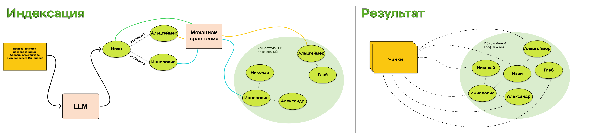
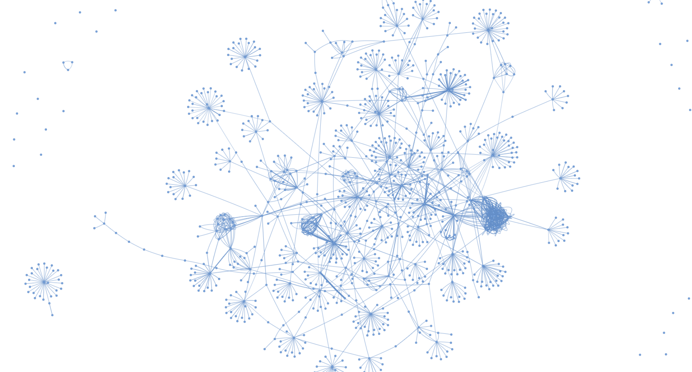
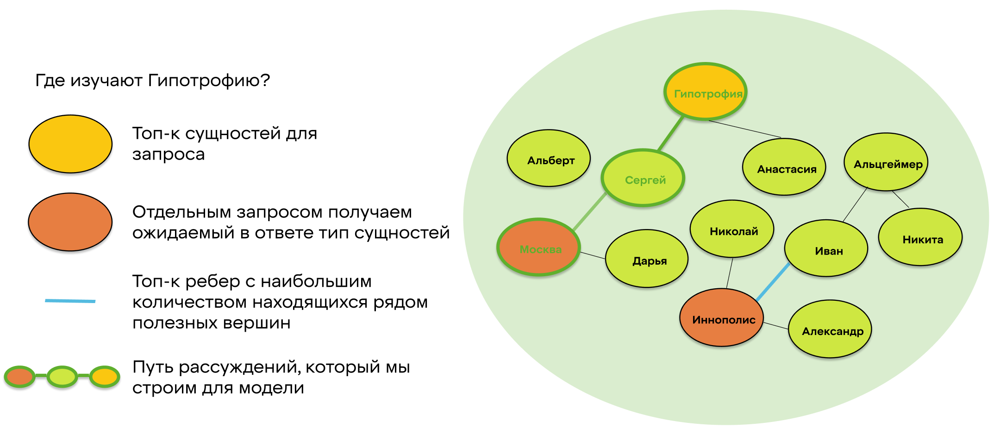

# Сравнение графовых RAG в чат-ботах

## Введение

### О чём статья и зачем

Всем привет! Мы — группа начинающих ML-специалистов в X5 Tech в команде чат-ботов. В этой статье мы расскажем о state-of-the-art подходах использующих графы знаний в RAG (Retrieval-Augmented Generation) и сравним три алгоритма: **FastRAG**, **LightRAG** и **MiniRAG**. Также исследуем, как эти методы показывают себя в сравнении с классическим RAG в обработке баз знаний и поиска релевантной информации.

### Что такое RAG

**RAG** — это гибридная архитектура, сочетающая поиск информации и генерацию текста через LLM. Классический RAG использует лексический или семантический поиск по текстовым фрагментам в базе знаний. Затем найденная информация и запрос подаются в LLM, чтобы она, используя необходимую информацию, ответила на запрос. Подробнее можно почитать [здесь](https://habr.com/ru/articles/779526/).  

<figure>
  
  <figcaption>
    <strong>Рисунок 1:</strong> Иллюстрация архитектуры RAG.<br>
    Источник: <a href="https://commons.wikimedia.org/wiki/File:RAG_diagram.svg" target="_blank">wikimedia</a>
  </figcaption>
</figure>

### Зачем нужен графовый RAG

К сожалению, обычный RAG не лишён недостатков:  
1. Ограниченная семантическая интеграция: извлечение информации происходит без учета междокументных и внутридокументных связей. 
2. LLM не понимает полного контекста, так как берётся только часть исходных данных.  
3. При увеличении количества данных ухудшается качество поиска.
4. Отсутствие структурированных связей: Стандартный RAG не моделирует отношения между сущностями в данных.

RAG, основанный на графе знаний, способен полностью или частично решить данные недостатки.

### Что такое граф знаний

**Граф знаний** — это структура данных, где:  
- **Узлы** — сущности (например, `ПОКУПАТЕЛЬ`, `ДИРЕКТОР`) или целый документ.  
- **Рёбра** — связи между ними (например, *«регулируется»*, *«влияет на»*).  

В отличие от обычного векторного поиска, графы сохраняют семантические отношения. Это позволяет связывать информацию из различных документов и отвечать на более сложные вопросы.  

<figure>
    
  <figcaption>
    <strong>Рисунок 2:</strong> Схема графа знаний <br>
  </figcaption>
</figure>

### Использование графа знаний

Графовые RAG имеют схожую структуру с обычным алгоритмом, но вносят изменения в некоторые шаги:  
 1. **Индексация**: из документов извлекаются сущности и связи (через LLM), формируя граф.  
 2. **Поиск**: вместо векторного сравнения фрагментов система обходит граф, находя связанные сущности и контексты.  
 3. **Генерация**: LLM получает не только текстовые фрагменты, но и пути из графа, что улучшает связность ответов.  

Впервые идея использования графов знаний для RAG`ов была представлена в рамках Microsoft GraphRAG, опубликованного в начале 2024. На данный момент это направление активно развивается благодаря новым подходам предлагающим более интуитивное понимание контекста и state-of-the-art показатели на вопросно-ответных бенчмарках.

## Теория

### Виды графов знаний


**Графы знаний** бывают двух видов: **сущностные** и **контекстные**.

#### Сущностный граф знаний
Сущностный граф знаний представляет информацию в виде узлов и связей, где:
- **Узлы** обозначают конкретные сущности (люди, места, объекты и т.д.),
- **Связи** отражают отношения между сущностями.

Например:
- Узел, представляющий человека, может быть связан с узлом, представляющим город, посредством связи «живет в», указывающей на место проживания.
- Два узла, представляющие компании, могут быть связаны через связь «конкурент», показывая их конкурентные отношения.
- Узел, представляющий произведение искусства, может быть связан с узлом, представляющим художника, посредством связи «создано», указывающей на автора.

В сущностных графах знаний акцент делается на конкретных сущностях и их взаимосвязях, что позволяет эффективно моделировать и анализировать сложные сети отношений в различных областях знаний.


#### Контекстный граф знаний
Контекстный граф знаний — это структура данных, где:
- **Узлы** содержат исходные данные (текстовые отрывки, изображения, таблицы и т.д.).
- **Связи** отражают структурные или семантические отношения между этими данными.

Ребра между узлами могут представлять различные типы связей:
- Фрагмент текста с гиперссылкой может быть связан с соответствующим контентом.
- Два фрагмента с общими ключевыми словами могут иметь связь, указывающую на их схожесть.
- Отрывки в документе могут ссылаться на определения ключевых терминов.

В отличие от сущностных графов, где информация сокращается до простых аннотаций, контекстные графы сохраняют полноту исходных данных. Данные такого вида более эффективны в качестве контекста для LLM. 

### Microsoft GraphRAG: откуда всё начиналось


**Microsoft GraphRAG** — это метод, представленный Microsoft Research в 2024 году, который сочетает RAG с графовыми структурами для улучшения обработки сложных текстовых данных. Он создан для эффективного поиска, анализа и генерации информации в неструктурированных источниках, таких как корпоративные документы и научные статьи.

#### Отличительные особенности:
- Гибридный подход, совмещающий элементы контекстного и сущностного графа знаний.
- Группировка узлов в сообщества с построением иерархии, что позволяет моделям LLM лучше понимать контекст.
- Использование LLM для построения графа без явной разметки данных.

#### Основные шаги
1) Индексация
    - **Разделение текста:** Входной корпус текста разделяется на фрагменты, которые выступают в роли анализируемых единиц, обеспечивая детализированные ссылки в результатах.
    - **Извлечение данных:** С помощью LLM извлекаются сущности, отношения и ключевые утверждения.
    - **Иерархическая кластеризация:** Граф кластеризуется с использованием метода Лейдена. Для визуализации процесса каждый круг представляет сущность (например, человека, место или организацию), его размер отражает степень значимости, а цвет – принадлежность к сообществу.
    - **Генерация суммаризации:** Суммаризация создаётся для каждого сообщества и его элементов, что помогает в понимании набора данных «снизу вверх».

2) Генерация
    - **Глобальный поиск:** Использует суммаризации сообществ для рассуждения о целостных вопросах, касающихся корпуса текста.
    - **Локальный поиск:** Расширяет запрос до соседей и связанных концепций для конкретных сущностей.
    - **DRIFT-поиск:** Похож на локальный поиск с добавлением контекста информации о сообществах.

### Механизм постепенного обновления графа

Реализация Microsoft GraphRAG имеет существенный недостаток: при добавлении новых документов требуется полная переиндексация графа знаний. Это затрудняет поддержание актуальности данных. Современные алгоритмы предлагают решение в виде инкрементального обновления, позволяющего наращивать и корректировать граф без необходимости его полного перестроения.

При итеративной обработке документов реализуется следующий подход для обновления графа знаний:



1. **Извлечение сущностей и связей.** На этом этапе с помощью few-shot промпа LLM извлекаются ключевые сущности из документа, а также устанавливаются связи между ними.

2. **Идентификация синонимичных сущностей.** Далее проводится анализ на предмет синонимии и похожести сущностей, что помогает объединить повторяющуюся информацию и оптимизировать структуру графа. Для выявления синонимов зачастую используется посимвольное сравнение или косинусное сходство между эмбеддингами сущностей.

3. **Инкрементальное обновление графа.** Существующий граф знаний обновляется за счёт интеграции новой информации, извлечённой из документов, без необходимости полной перестройки. Это обеспечивает оперативное пополнение графа и его актуальность.
    - **Связывание с исходным документом.** Каждая обновлённая сущность дополнительно связывается с документом, из которого была получена информация.


## Алгоритмы, которые мы пробовали
В ходе исследования мы отобрали три state-of-the-art алгоритма, предоставляющих различные подходы к работе с графами знаний: **Fast GraphRAG**, **LightRAG** и **MiniRAG**. Эксперименты с этими моделями заключались в оценке их производительности и точности в контексте наших данных и с использованием наших продовых LLM моделей. 

### Fast GraphRAG

**Fast GraphRAG** — это открытая библиотека, предназначенная для улучшения процессов извлечения и генерации информации с помощью графов знаний.

#### Особенности Fast GraphRAG:
- **Динамическое обновление данных:** Автоматическая генерация и уточнение графов в соответствии с изменениями данных и требованиями предметной области.
- **Инкрементальные обновления:** Поддержка поэтапного добавления данных, обеспечивающая гибкость и адаптивность системы.
- **Интеллектуальное исследование:** Использование модифицированного алгоритма Page Rank для оценки важности вершин в графе с учётом предпочтений пользователя.

#### Индексация

Механизм индексации в Fast GraphRAG основан на инкрементальном подходе, который позволяет обновлять граф знаний без необходимости полной переиндексации. Семантический поиск находит синонимичные сущности в новом и уже существующем графе. После этого происходит обновление структуры графа, что позволяет поддерживать его актуальность и целостность. 

#### Ретрив
1. **Выделение сущностей из запроса:** Few-shot промпт передаётся в LLM вместе с запросом пользователя для извлечения сущностей. Далее найденные сущности преобразуются в векторное представление с использованием эмбеддера. С помощью косинусного сходства производится поиск n ближайших узлов, которые считаются стартовыми.

2. **Поиск релевантных узлов:** Алгоритм Personalized Page Rank вычисляет значимость узлов графа, начиная с узлов, наиболее близких к запросу.<br><br>
**Инициализация PPR:**
<br><br>
Задаётся вектор предпочтений **v**, где каждому узлу, связанному с запросом пользователя присваивается значение 1, всем остальным - 0. Далее все вероятности нормализуются так, чтобы их сумма равнялась 1.
<br><br>
**Итеративное обновление:**
<br><br>
На каждом шаге вычисляется новый вектор вероятностей **r** с учётом двух факторов:
- Вероятности перехода между узлами графа (на основе матрицы смежности графа **A**).
- Вероятности возврата к узлам, связанным с запросом пользователя (вектор предпочтений **v**).
<br><br>
**Формула PPR:**<br>
Алгоритм обновляет вектор вероятностей **r** на каждой итерации по следующей формуле:<br><br>
`r = α * (A^T * r) + (1 - α) * v`<br><br>
Где:
- **r** — вектор вероятностей для всех узлов графа.
- **A** — нормализованная матрица смежности графа (каждая строка нормализована так, чтобы сумма элементов равнялась 1).
- **v** — вектор предпочтений, задающий начальное распределение вероятностей.
- **α** — коэффициент затухания (обычно выбирается в диапазоне [0.85, 0.95]), который определяет вероятность перехода по рёбрам графа или возврата к узлам из вектора предпочтений.
<br><br>
Алгоритм повторяет итерации до тех пор, пока изменения в векторе **r** между шагами не станут меньше заданного порога. Итоговый вектор **r** содержит вероятности, которые отражают важность каждого узла графа с учётом персонализации.

3. **На основе извлечённых данных формируется итоговый запрос:**
```
{Сущности}
{Отношения}
{Документы}
{Запрос пользователя}

Проанализируй сущности и отношения между ними. Далее выбери наиболее релевантные документы и ответь на вопрос пользователя.
```

>Недостатки Fast GraphRag
>- Подверженность шуму исходных данных
>- Значительная часть логики алгоритма возлагается на LLM
>- Ограниченность информации в запросе может снизить точность оценки важности, так как PPR полагается на структуру графа, а не на семантическое понимание
>- Требует тщательной настройки под каждый домен знаний


### Общий обзор LightRAG <small>[[arXiv]](https://arxiv.org/abs/2410.05779)</small>

LightRAG — это [open-source библиотека](https://github.com/HKUDS/LightRAG) для реализации метода RAG, основанного на графовых структурах. Основное отличие LightRAG — двухуровневая система поиска, которая позволяет:
- Находить как общие концепции (высокоуровневый поиск)
- Извлекать детализированную информацию о конкретных сущностях (низкоуровневый поиск)

Ключевые преимущества:
- **Высокая скорость** работы при минимальных затратах ресурсов
- **Гибкость**: адаптация к новым данным без полной переиндексации (как в FastRAG)
- Поддержка сложных запросов за счет графовых связей между сущностями

#### Индексация данных в LightRAG

Процесс подготовки данных включает шесть этапов:

1. **Сегментация текста**  
   Документы разбиваются на небольшие фрагменты для упрощения анализа.

2. **Извлечение сущностей и отношений**  
   Для каждого фрагмента определяются:
   - **Сущности** (например, `Иван`, `Альцгеймер`) с атрибутами:
     - Имя
     - Тип (персона, заболевание и т.д.)
     - Описание
   - **Отношения** между сущностями с параметрами:
     - Исходная и конечная вершины
     - Описание связи
     - Сила связи (шкала от 1 до 10)

3. **Генерация ключей**  
   Создание уникальных идентификаторов:
   - Для сущностей — их имена
   - Для отношений — несколько ключевых слов, отражающих суть связи

4. **Дедубликация**  
   Объединение идентичных сущностей и отношений для уменьшения размера графа знаний.

5. **Построение графа знаний**  
   Формирование структуры, где:
   - Узлы = сущности
   - Рёбра = отношения между ними

Также есть возможность посмотреть на созданный граф знаний. Это помогает лучше понять структуру базы знаний.

<figure>
    
  <figcaption>
    <strong>Рисунок 6:</strong> Визуализация LightRAG графа знаний <br>
  </figcaption>
</figure>

#### Ретрив в LightRAG

Существует 2 уровня поиска:

1.  **Низкоуровневый поиск.** Он фокусируется на конкретных сущностях. Например: “Где живёт Иван, который изучает Альцгеймера”. Этот уровень сконцентрирован на получении сущностей, их характеристиками и отношениями.
2.  **Высокоуровневый поиск,** охватывающий общие темы и концепции. Он концентрируется на отношениях между сущностями, например, что такое Альцгеймер? Запросы на этом уровне объединяют информацию по нескольким связанным объектам и взаимосвязям.

Ретрив включает себя использование графа знаний и векторного представления его элементов. Поиск разбит на несколько этапов:

1.  **Извлечение ключевых слов.** Вначале, с помощью LLM, из запроса извлекаются ключевые слова (отдельно для низкоуровневого и высокоуровневого запроса).
2.  **Сопоставление ключевых слов.** Ключевые слова низкоуровневого запроса сопоставляются с сущностями, затем ключевые слова высокоуровневого – с отношениями.
3.  **Поиск дополнительной информации.** Чтобы улучшить связанность ответа, LightRAG использует всех соседних (смежных) вершин графа, найденного на предыдущем этапе.
4.  **Передача информации в LLM**. На последнем этапе отношения, вершины и полученные фрагменты документов передаются LLM для получения финального ответа.

Двухуровневая поисковая система облегчает эффективный поиск связанных сущностей и связей за счет подбора ключевых слов и повышает полноту результатов за счет использования графа знаний.

#### Ограничения и проблемы LightRAG

Несмотря на высокую скорость индексации и ретрива, LightRAG демонстрирует более низкую точность по сравнению с классическим RAG на наших датасетах. Это связано с несколькими ключевыми факторами:

**1. Зависимость от гиперпараметров**
Алгоритм критически зависит от настройки:
- `top_k` (количество возвращаемых результатов)
- Распределение токенов между сущностями, связями и документами
- Промпт для LLM
- `similarity_threshold` (порог схожести)

Для достижения приемлемого качества пришлось перебрать десятки комбинаций параметров.

**2. Потеря информации при малом количестве сущностей**  
При работе с документами, где отсутствуют уникальные сущности, релевантные фрагменты часто "тонут" среди похожих, но нерелевантных результатов. Например, общие термины вроде "отпуск" могут подавлять специфические запросы вроде "отгул".

**3. Проблемы ранжирования отношений**  
LLM часто присваивает неправильные веса отношениям в графе. Это приводит к парадоксальным ситуациям:
- Вершины с множеством связей получают неоправданно высокий ранг
- Узлы с уникальной информацией могут оказаться в конце выдачи

Пример: запрос *"Как взять отгул?"* возвращает документы про отпуск, так как LLM приписала отношениям с "отпуском" больший вес, несмотря на редкость термина "отгул" в датасете.

**4. Эффект "переполнения соседями"**
При выборе всех соседей найденной вершины возникают проблемы:
- Релевантные документы теряются среди множества смежных узлов
- Падает точность ответов из-за шума в данных

Этот эффект хорошо виден на визуализации графа знаний (Рисунок 7):

<figure>
  
  <figcaption>
    <strong>Рисунок 7:</strong> Визуализация проблем LightRAG<br>
    <em>Красный круг:</em> избыточное количество соседей у одной вершины<br>
    <em>Зелёный круг:</em> оптимальная структура графа
  </figcaption>
</figure>

### MiniRAG  
MiniRAG это модификация подхода LigthRAG, которая меньше использует LLM на этапе ретрива и делегирует составление контекста к запросу графовым алгоритмам. Авторы предлагают формулы для определения полезности сущностей, рёбер и путей графа для контекта. На основе данных показателей алгоритм находит в графе путь рассуждений, который наиболее логично соединяет вершины и ребра связанные с контекстом запроса.

#### Индексация

Процесс почти полностью повторяет индексацию LigthRAG

- С помощью one-shot промпта превращаем каждый текстовый фрагмент в 2 таблицы
  - Информация о сущностях (Название, тип)
  - Информация о связях (смежные вершины, короткое описание, численная сила связи)  

- Дедуплицируем с уже находящимися в графе элементами и добавляем новые
- В отличии от LigthRAG не извлекаем high и low-level keywords

#### Ретрив

Можно выделить 4 основных этапа

- **Нахождение релевантных к запросу сущности**  
  Для построения путей рассуждения нам понадобятся вершины из которых мы можем начать.  
  С помощью zero-shot промпта выделяем сущности в запросе пользователя и для каждой найденной сущности находим ближайшую вершину в графе используя эмбеддинги.  

- **Нахождение релевантных к ответу сущности**  
  При семантическом поиске в общем случае расстояние между похожими запросами будет меньше, чем расстояние от запроса до правильного документа, похожего по смыслу. Это связано с различиями в структуре запроса и документа и в их длине.

  ``` python
  query = "Когда Карл Маркс начал писать Капитал?"
  query2 = "Как Капитал изменил жизнь Карла Маркса?"
  query2_answer = "Карл Маркс начал работать над своей знаменитой книгой 'Капитал' в 1857 году, и это стало центральным проектом его жизни. Несмотря на финансовые трудности и болезни, он упорно работал над трудом, который в конечном итоге значительно укрепил его репутацию как одного из ведущих теоретиков социализма. Первый том 'Капитала' был опубликован в 1867 году, но Маркс не успел закончить второго и третьего томов, которые были опубликованы уже после его смерти его другом и соратником Фридрихом Энгельсом. Эта работа не только изменила его личную жизнь, но и оказалась влиятельной для всего мирового социального и экономического движения."

  # Embed the texts
  emb_query = hf_embeddings.embed_query(query)
  emb_query2 = hf_embeddings.embed_query(query2)
  emb_query2_answer = hf_embeddings.embed_query(query2_answer)
  # Calculate cosine distances
  distance_query_query2 = cosine(emb_query, emb_query2)
  distance_query_query2_answer = cosine(emb_query, emb_query2_answer)
  # Print the distances
  print(f"Cosine distance between emb_query and emb_query2: {distance_query_query2}")
  print(f"Cosine distance between emb_query and emb_query2_answer: {distance_query_query2_answer}")

  >>>Cosine distance between emb_query and emb_query2: 0.0639
  >>>Cosine distance between emb_query and emb_query2_answer: 0.1163
  ```
  Поэтому, проводя поиск только на основе векторизированного запроса, мы рискуем упустить релевантные сущности.
  
  Для нахождения сущностей, релевантных именно ответу, мы просим LLM определить релевантные типы сущностей и выделяем из общего графа подмножество подходящих вершин.  
  Эти вершины будут конечными вершинами путей рассуждений.

- **Выделение релевантных ребер графа**  
  Мы уже нашли подмножества начальных и конечных вершин для путей рассуждений. Осталось найти промежуточные ребра для упрощения перебора возможных вариантов.  
  Отбираем ребра смежные к найденным вершинам. Сортируем их используя следующую формулу важности ребра
  
  `ωe(e) = ∑[count(v̂s, Ge,k), v̂s ∈ ̂Vs] + ∑[count(v̂a, ̂Ge,k) + v̂a ∈ ̂Va]`
  - **ωe(e)** — полезность ребра для пути рассуждения.
  - **Vs** — сущности релевантные к запросу.
  - **Va** — сущности, предположительно релевантные к ответу.
  - ** ̂Ge,k** —  Подграф включающий включающий все сущности, не дальше чем на k рёбер от текущего ребра.

  

- **Построение пути рассуждений**  
  Теперь мы готовы провести логический путь от запроса к ответу по нашему графу. Перебираем пути длины n соединяющие вершины запроса с вершинами для ответа и сортируем их по количеству попавших в путь релевантных ребер и вершин.
  
  Ранжируем пути на основе следующей формулы
  `ωp(p | v̂q) = ωv(v̂s | v̂q) +(1 - ∑[count(v̂, p), v̂ ∈ p ^ Va] + ∑ωe(e), e ∈ Eα])`
  - **ωp(p | v̂q)** — полезность конкретного пути.
  - **ωv(v̂s | v̂q)** — семантическая схожести вершины начала пути с изначальным запросом пользователя.
  - **Va** — сущности, предположительно релевантные к ответу.
  - **Eα** —  релевантные рёбра графа.
  Получив топ k лучших путей, мы формируем контекст из их сущностей и привязанных к ним документов.

- **Формирование контекста**
```
{Системные инструкции}
{Сущности}
{Документы}
{Запрос пользователя}
```
>Недостатки MiniRAG
>- Иногда при поиске релевантных вершин алгоритм концентрируется на общих терминах больше чем ключевых словах домена Х5, из за этого в ретрив попадает много общих документов и нужные документы остаются в конце контекста или вообще не попадают в него.
>- Индексация графа может занимать часы.
>- Конечный граф не является связным(однако вне основного компонента находится в основном шум).

## Результаты

- **Дизайн экспериментов**  
  В рамках нашего исследования мы сосредоточились на тестировании алгоритмов в контексте домена X5. Мы провели серию экспериментов на двух различных базах знаний, чтобы тщательно оценить применимость и эффективность этих алгоритмов для обработки различных типов данных. 
  - Первая база знаний содержала около 500 рабочих инструкций и в качестве бейзлайна ретрива мы использовали Qdrant.
    В качестве бейзлайна генерации мы использовали комбинацию RAG -> Reranker -> Chaining.
  - Вторая база знаний состояла из примерно 1500 записей в формате вопрос-ответ. Здесь бэйзлайн для ретрива был основан на RAG с использованием симметричного поиска.
        
    
- Лучшие метрики среди проведенных экспериментов
- *Ретрив* 

- *Генерация для Базы Знаний с инструкиями*


## Заключение
- В ходе некоторых экспериментов нам удалось воспроизвести характерные метрики генерации продовых пайплайнов. Однако, это может быть обусловлено особенностями задачи и структурой данных.
- Поскольку показатели ретрива были основаны на документах, которые попали в контекст, и не принимали во внимание сущности, показатели генерации были воспроизведены, несмотря на разницу в метриках ретрива.
- Использование графовых RAG может показать сильный прирост метрик в задачах, где требуется не находить конкретный документ или инструкцию, а комбинировать ответ на вопрос из элементов, находящихся в разных документах.

